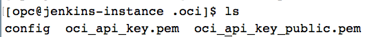
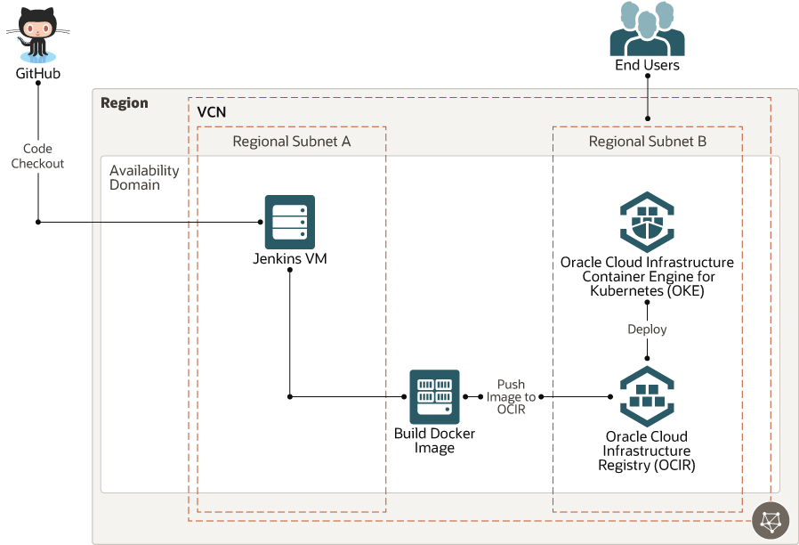

# oci-arch-ci-cd

Quick delivery of software has become a competitive advantage for companies. The automation of development processes facilitates speed and consistency, which led to the rise of continuous integration (CI) and continuous delivery and deployment (CD) pipelines. Jenkins is a popular product among Oracle Cloud Infrastructure customers that can automate all phases of CI and CD.

In this reference architecture, Jenkins is hosted on Oracle Cloud Infrastructure to centralize build automation and scale the deployment by using Oracle Cloud Infrastructure Registry and Container Engine for Kubernetes. GitHub is used to manage source code.

## Terraform Provider for Oracle Cloud Infrastructure
The OCI Terraform Provider is now available for automatic download through the Terraform Provider Registry. 
For more information on how to get started view the [documentation](https://www.terraform.io/docs/providers/oci/index.html) 
and [setup guide](https://www.terraform.io/docs/providers/oci/guides/version-3-upgrade.html).

* [Documentation](https://www.terraform.io/docs/providers/oci/index.html)
* [OCI forums](https://cloudcustomerconnect.oracle.com/resources/9c8fa8f96f/summary)
* [Github issues](https://github.com/terraform-providers/terraform-provider-oci/issues)
* [Troubleshooting](https://www.terraform.io/docs/providers/oci/guides/guides/troubleshooting.html)

## Clone the Module
Now, you'll want a local copy of this repo. You can make that with the commands:

    git clone https://github.com/oracle-quickstart/oci-arch-ci-cd
    cd oci-arch-ci-cd
    ls

## Prerequisites
First off, you'll need to do some pre-deploy setup.  That's all detailed [here](https://github.com/cloud-partners/oci-prerequisites).

Secondly, create a `terraform.tfvars` file and populate with the following information:

```
# Authentication
tenancy_ocid         = "<tenancy_ocid>"
user_ocid            = "<user_ocid>"
fingerprint          = "<finger_print>"
private_key_path     = "<pem_private_key_path>"

# SSH Keys
ssh_public_key  = "<public_ssh_key_path>"

# Region
region = "<oci_region>"

# Compartment
compartment_ocid = "<compartment_ocid>"

````

Deploy:

    terraform init
    terraform plan
    terraform apply


## Post-Deployment Setup 

### Step 1: Configure oci-cli and sudo user on Jenkins Instance

Go to OCI console -> Compute -> Instances.

You should be able to see the instance `jenkins-instance`

Copy the public-ip of the instance. Log in to the instance using below command.

`ssh -i <path-to-ssh-private-key> opc@<public-ip-of-jenkins-instance>`

Once you are logged in, make sure oci-cli is installed using:

`oci -v`

Next, run the command `oci setup config`

Press `Enter` when prompted for a location for config file.

Press `Enter` when prompted for directory name to accept the default.

Enter the details about user OCID, tenancy OCID and region.

Enter `Y` for `New RSA key pair`. 

Press Enter and accept default options for directories for keys and name for the keys. 

Press Enter when prompted for passphrase so as to leave it blank.

Verify all the files exists by checking in -> `cd /home/opc/.oci` and then `ls`.

You should see these files.



Run `cat config` and make sure all the details about tenancy are correct.

Now, do `cat oci_api_key_public.pem` and copy the contents of the file. 

Login to OCI console, go to your profile and then your username. 

Click on `Add Public Key` and paste the contents of the file copied in last step. 

Make sure the `fingerprint` is generated and also check it is same as the one in Jenkins Instance `/home/opc/.oci/config` file. 

Next, to add sudo user to Jenkins Server, on Jenkins Instance, do

`sudo visudo -f /etc/sudoers.d/filename`

Press `i` for insert mode. Now we just need to include the line listed below in our file:

`jenkins ALL=(ALL) NOPASSWD: ALL`

Save and Exit from edit mode,

`Press ESC and type :wq! and hit Enter`. You should be out of the edit mode.

We are done.

### Step 2: Configure OCI tenancy details on Jenkins UI

Go to OCI console -> Compute -> Instances.

You should be able to see the instance `jenkins-instance`

Copy the public-ip of the instance. Open a browser and enter 

`<public-ip-of-the-instance>:8080`

This should give you a Jenkins UI. Login using username as `admin` and password as `Admin123`.

```WARNING make sure this step is right
On the Jenkins UI, In Manage Jenkins screen on the left, Click Configure System, scroll down and locate `Cloud`.

Click on 'Add a new cloud'. Now, under drop down select 'Oracle Cloud Infrastructure Compute'. 

New dialog box will appear.

Enter 'Name: <Use easy to remember name>'. 
Next to 'Credentials', click on 'Add' and from the dropdown select 'Jenkins'.

This opens up a dialog box. Keep the 'Domain' as it is. 
For Kind, Choose 'Oracle Cloud Infrastructure Credentials'.

For rest, Fill out the dialog box:

Name: Use easy to remember name
Fingerprint: Copy/paste OCI_api_key_fingerprint value from the config file saved in step 1.
APIKey: Copy/paste oci_api_key.pem file content saved in /home/opc/.oci folder in step 1.
PassPhrase: Leave empty
Tenant Id: Copy/paste Tenant OCID.
User Id: Copy/paste User OCID.
ID: Leave empty
Description: Leave empty
Region: Type your region Name (Shown in OCI console window, us-ashburn-1 etc)

Click Verify Credentials and make sure for ‘Successful’ message. We have now verified connectivity to OCI via the Jenkins compute node.

Click on Add.
```

Finally, come down and make sure to click on `Save`

## Step 3: Configure Github webhook

Go to the repo https://github.com/KartikShrikantHegde/jenkins-helloworld. Fork it. 

On the right side, Go to `Settings`. Then on the left, click on `Webhooks`. 

You should see an option to `Add webhook`. click on it. 

For `Payload URL` enter -> `http://<public-ip-of-the-instance>:8080/github-webhook/`

For `Content type`, choose -> `application/json`

Leave the secret field blank.

select `send me everything` for the field For `Which events would you like to trigger this webhook`

Add webhook and you are done.

## Step 4: Generate github token

Now click on your github account profile, and click on Settings.

On the left side, you will see an option `Developer settings`. Click on it.

Again on the left, click on `Personal access tokens`. Click `Generate new token`.

Enter a note, select all the options under `Select scopes` and click on `Generate token` at the bottom.

This will generate a one time token. Copy and save it for future steps.

## Step 5: Add the github token to Jenkins UI

On the Jenkins UI, In Manage Jenkins option on the left , Click Configure System.

Scroll down a bit and you will see `GitHub` section.

Under that, Click on `Add Github Server` and then again `Github Server` from the dropdown. This opens up a window.

Enter the details:

Name -> `Specify a name`

API URL -> leave the default url as it is.

Credentials -> Click on `Add` button and then `Jenkins` under the dropdown. This opens a new window. 

Here, change the Kind to `Secret Text`.

Under Secret -> Enter the access token that was generated in the previous step 4. Leave rest of the fields blank.

Under Credentials, change option from none to `Secret text`.

Click on Test connection and it should show `Credentials verified for <user>`. So now our Jenkins can access our repo.

Check right mark on the `Manage hooks`

Go down to the bottom and make sure to click on `Save`.

## Step 6: Generate OCIR token

Login to OCI console.

Click on your `Profile` -> `User Settings`. On the bottom left, click on `Auth Tokens`. 

Click on `Generate Token`.

Provide a discription and then hit `Generate Token`. This will generate a token. Make sure to copy the token for future steps.

## Step 7: Update deployment files and copy to jenkins server

In your local working directory, you should be able to see 2 files `hello-deploy.sh` and `hello.yaml` along with other terraform files.

Open both the files and add in details specific to your tenancy.

For `hello-deploy.sh`, update details for these fields:

`<region-prefix-name>` -> eg: iad.ocir.io (for ashburn region)

`<username>` -> `<your-tenancy-namespace>/oracleidentitycloudservice/<your-oci-user-email-here>` (look for namespace in tenancy details on your OCI console for `<your-tenancy-namespace>`)

`<ocir-token>` -> the token we generated in previous step 6

For `hello.yaml`, update:

`<region-prefix-name>` - eg: iad.ocir.io (for ashburn region)

`<your-tenancy-namespace>` -> (look for namespace in tenancy details on your OCI console for `<your-tenancy-namespace>`)

Once updated, lets copy these files into jenkins instance.

From your local working directory where you have these files stored, copy the files into jenkins server using below commands.

`scp -i <path-to-ssh-private-key> hello-deploy.sh opc@<public-ip-of-jenkins-instance>:/home/opc`

`scp -i <path-to-ssh-private-key> hello.yml opc@<public-ip-of-jenkins-instance>:/home/opc`

Now, login to your instance -> `ssh -i <path-to-ssh-private-key> opc@<public-ip-of-jenkins-instance>`

Finally, copy both `hello-deploy.sh` and `hello.yml` to /var/lib/jenkins as:

`sudo cp hello.yml /var/lib/jenkins`
`sudo cp hello-deploy.sh /var/lib/jenkins`

## Step 8: Update Jenkinsfile in Github repo

Go to the forked Github repo from https://github.com/KartikShrikantHegde/jenkins-helloworld.

Next, in the repo, you should be able to find `Jenkinsfile`. Let's update the `Jenkinsfile`.

In the `Jenkinsfile`, go to `stage('Push image to OCIR')` and update details related to your tenancy:

`<username>` -> `<your-tenancy-namespace>/oracleidentitycloudservice/<your-oci-user-email-here>` (look for namespace in tenancy details on your OCI console for `<your-tenancy-namespace>`)

`<ocir-token>` -> the token we generated in previous step 6

`<region-prefix-name>` -> eg: iad.ocir.io (for ashburn region)

`<your-tenancy-namespace>` -> (look for namespace in tenancy details on your OCI console for `<your-tenancy-namespace>`)

Edit all the details and save the file.

## Step 9: Install Kubectl and configure kube-config on Jenkins

ssh into jenkins instance and install and verify kubectl using below single command.

````
curl -LO https://storage.googleapis.com/kubernetes-release/release/`curl -s https://storage.googleapis.com/kubernetes-release/release/stable.txt`/bin/linux/amd64/kubectl;chmod +x ./kubectl;sudo mv ./kubectl /usr/local/bin/kubectl;kubectl version --client
````

Now, to setup kubeconfig, go to your OCI tenancy. On the left hand side click on `Developer Services`. Select `Container Clusters (OKE)`. 
 
Click on the cluster created by terraform earlier.

On the top, click on `Access Kubeconfig` and run the commands specified (make sure you are inside the jenkins instance to run the commands). 

Once done, verify you can access the k8s nodes, by typing:

`kubectl get nodes`

You see details of the nodes running in the cluster. 

## Step 10: Create a pipeline using Blue Ocean

Finally, with all the configurations done, lets create the pipeline.

On the Jenkins UI,(refer step 2 on how to access Jenkins UI), on the left hand side, you should see `Open Blue Ocean`. Click on it. It opens a new page.

Select `Create a new Pipeline`. Next select `GitHub`. If it asks for a token provide the Github token we generated in `step 4`. 

Next, select your github profile. Search for the repo (`jenkins-helloworld`) you had forked and made the changes. 

Hit `Create Pipeline`.

This creates a pipeline and starts the build, test and deploy steps. Once completed (indicated by green tick), you can go back to jenkins instance and run below command.

`kubectl get services`

You see details of the services running on the nodes in the cluster. 

For the hello-service load balancer that you just deployed, you will see:
the external IP address of the load balancer (for example, 129.146.147.91)
the port number.

Open a new browser window and enter the url to access the hello application in the browser's URL field. For example, http://129.146.147.91

You should be able to access the application.

Fron now on, any changes you make to the github code, triggers a new build and deploy by jenkins. This completes the CI/CD cycle.

## Destroy the Deployment
When you no longer need the deployment, you can run this command to destroy it:

    terraform destroy

## CI/CD Architecture




## Reference Archirecture

- [Set up a CI/CD pipeline for cloud deployments](https://docs.oracle.com/en/solutions/cicd-pipeline/index.html)
